# Fashion MNIST Clothing Classification
## Introduction

The goal of this exercise was to implement a model that would allow classification of clothes photographs. Image classification is one of the most fundamental problems in ML. Given a set of images that are all labeled with a single category (digits 0...9), model should predict these categories for a novel set of test images and measure the accuracy of the predictions. There are a variety of challenges associated with this task, e.g. different points of view, image deformation, etc.

There are many different techniques and models to solve the problem of image classification.

In this project, I will discuss different classification models and compare them. I will begin with simple classic machine learning algorithms: K-nearest neighbors. For a more advanced model, I will implement a Convolutional Neural Network.

It will show that KNN achieves worse classification accuracy than CNN. The implemented approaches are evaluated by the accuracy of the predictions on test photos.

---

## Methods

### K Nearest Neighbours (KNN)

KNN classifier can work directly on images without feature extraction. Therefore, I didn&#39;t use extract features in any way. This technique can be described as discriminative modeling. It&#39;s purpose is to model conditional probability distribution. K-Nearest Neighbors is a non-parametric classification algorithm. The basic idea behind it is simple. Given a image to classify, find k images in the train set that are &quot;closest&quot;, that is the most similar to the test image. Assign the most frequent among k labels corresponding to neighbours to the test vector or image. I chose the same parameter k (k = 5) that was used in the Benchmark. Above this number I didn&#39;t get a better result.

To calculate the distance between two objects is used some closeness metric.

I used the optimized Euclidean distance method, also called L2 norm, without any loops:

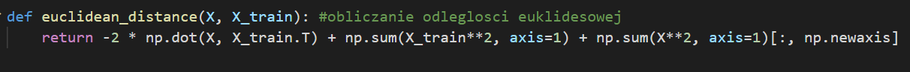

In order to compute the distance matrix efficiently I needed to vectorize the operation. By vectorizing I mean expressing the operations done on each pair of elements of matrices as an operation done on whole matrices.

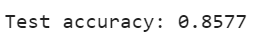

The final average accuracy of the model is **85.77%.** According to the Benchmarks result, the same classifier can achieve the result of **86.0%** accuracy. This small difference may have been caused by differences in implementation, e.g. implementation of different closeness metric or which class the algorithm has chosen if both had had the same probability.

### Fashion Mnist

This is a dataset of Zalando&#39;s article images.

Sample pictures (before adding distortion):

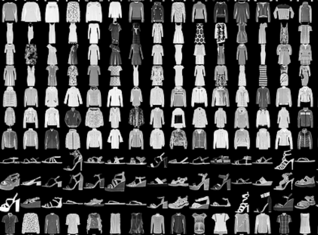

It consists of a training set (60,000 examples) and a test set (10,000 examples). Each image is a 28 x 28 array with values ranging from 0 to 255. Each example is associated with a label indicating one of 10 classes:

| Label | Description |
| --- | --- |
| 0 | T-shirt/top |
| 1 | Trouser |
| 2 | Pullover |
| 3 | Dress |
| 4 | Coat |
| 5 | Sandal |
| 6 | Shirt |
| 7 | Sneaker |
| 8 | Bag |
| 9 | Ankle boot |

Each example of training and test is assigned to one of the above labels.

### Import Fashion Mnist dataset with Tensorflow/Keras:

Fashion-MNIST dataset is downloaded from Keras dataset.

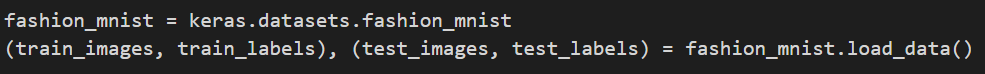

### Convolutional Neural Networks (CNN):

I&#39;ve created a simple CNN. I chose this classificator because it&#39;s the most popular neural network model used for image classification task. I built my model using the Keras framework.

The final average accuracy of the model is **92,32%.**

I trained the model in 50 epochs, compiled it with categorical\_crossentropy loss function and Adam optimizer:

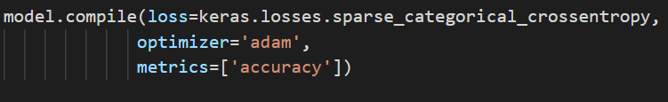

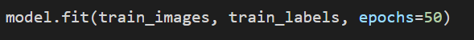

### Cutout/Random erasing

I also used Cutout/Random erasing implementation written by **yu4u** ([https://github.com/yu4u/cutout-random-erasing](https://github.com/yu4u/cutout-random-erasing)). This is a kind of image preprocessing methods for convolutional neural networks. It tries to regularize model by using training images with randomly changed or removed parts. I&#39;ve decided that 15% of training photos will be modified using this method. Function eraser() changes single input image.

This method contains several parameters that can be customized, e.g. the probability of changing images or the proportions of the changed image relative to the initial image:

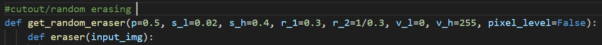

- p : the probability that random erasing is performed
- s\_l, s\_h : minimum / maximum proportion of erased area against input image
- r\_1, r\_2 : minimum / maximum aspect ratio of erased area
- v\_l, v\_h : minimum / maximum value for erased area
- pixel\_level : pixel-level randomization for erased area

Sample photo after using the eraser() function:

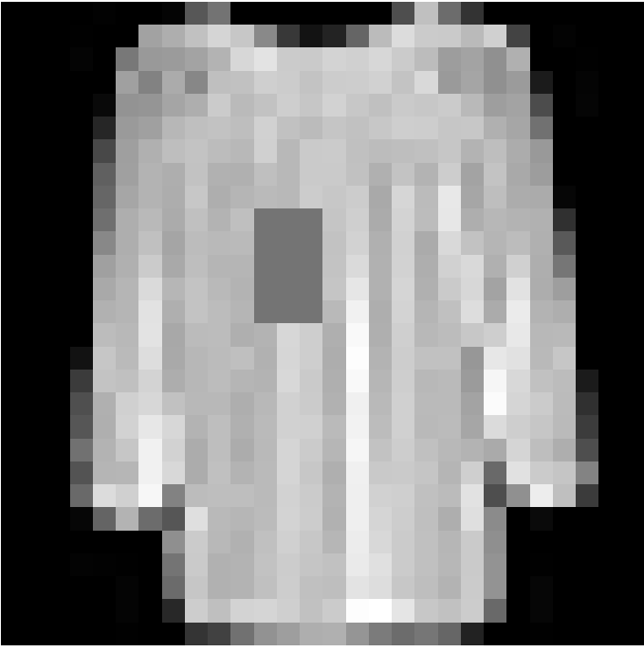

This is one of the images from the training dataset:

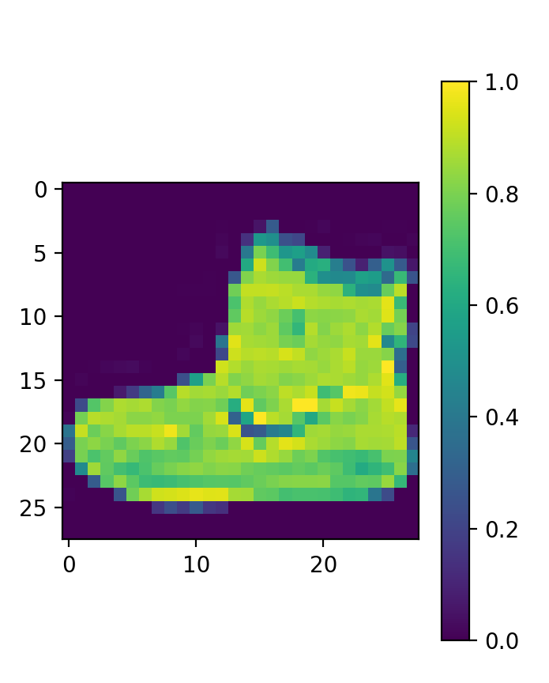

The data should be preprocessed before training the network. I scaled pixel color values to range from 0 to 1:

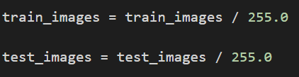

I also reshaped input images, as keras.layers.Conv2D requires that input image is 3 dimensional and those dimensions are (rows, columns, channels) for channels\_last data\_format. My images have only one color channel:

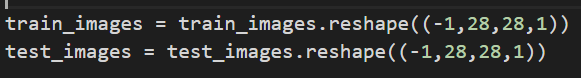

I used the Sequential model to create a simple CNN consisting of repeating structure: convolution layer, followed by a pooling layer then a dropout layer.

I defined the input data shape in the first layer. The last layer is a dense layer with softmax activation which classifies the data as one of 10 labels.

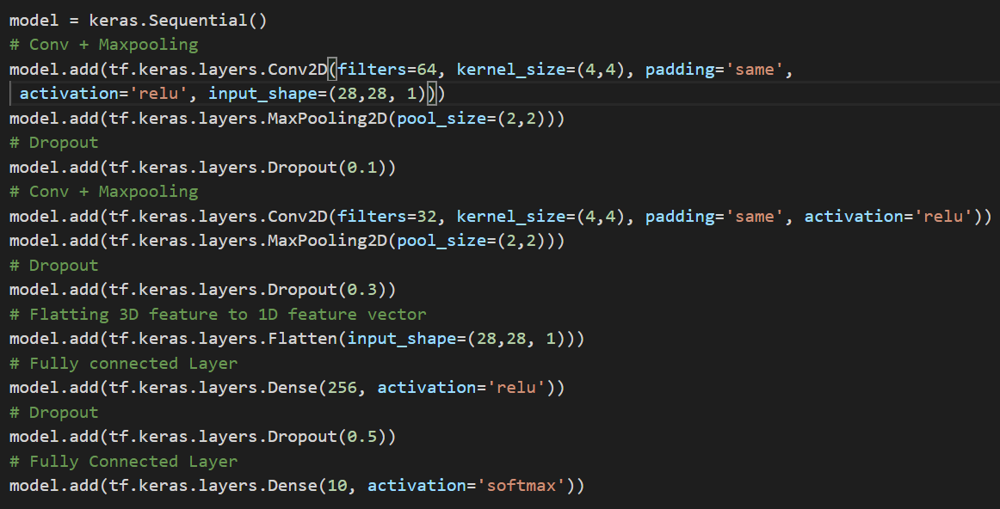

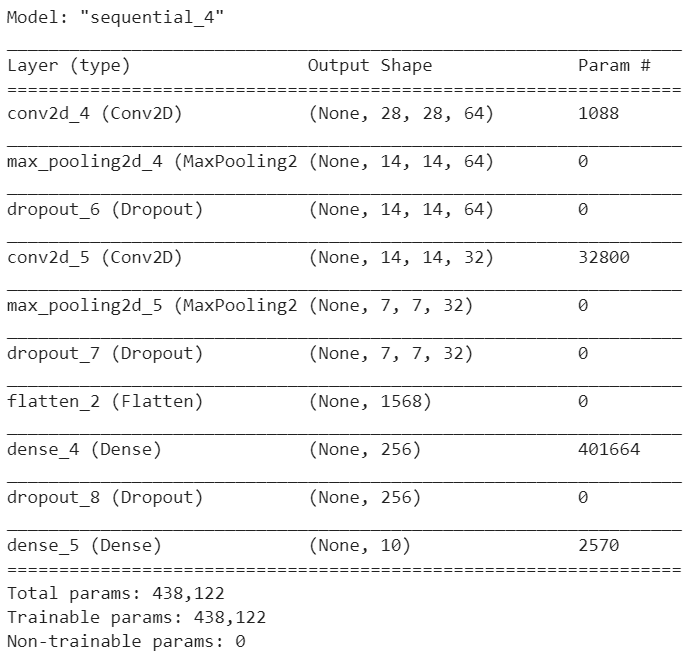

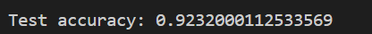

The final average accuracy of the model is **92.32%**. In the Benchmark this classifier achieved accuracy of **91,6%**. This small difference may have been caused by some differences in implementation, e.g. thanks to Cutout/Random erasing.

Correct prediction labels are blue and incorrect prediction labels are red. The number gives the percentage (out of 100) for the predicted label:

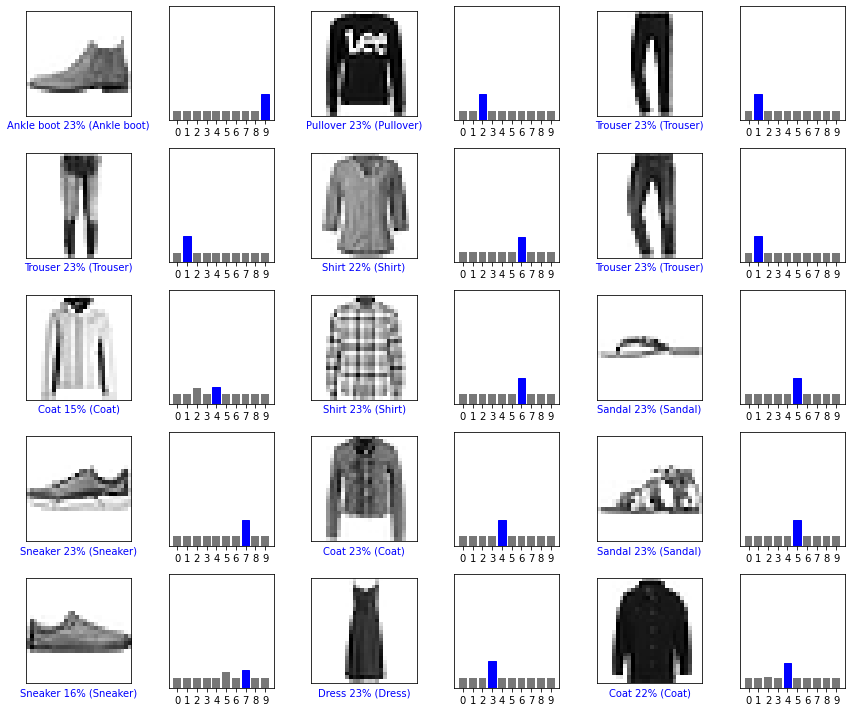

### Sources:

[https://www.youtube.com/watch?v=RJudqel8DVA&amp;feature=youtu.be](https://www.youtube.com/watch?v=RJudqel8DVA&amp;feature=youtu.be)

[https://www.youtube.com/watch?v=FiNglI1wRNk](https://www.youtube.com/watch?v=FiNglI1wRNk)

[https://medium.com/@souravdey/l2-distance-matrix-vectorization-trick-26aa3247ac6c](https://medium.com/@souravdey/l2-distance-matrix-vectorization-trick-26aa3247ac6c)

[https://medium.com/datadriveninvestor/k-nearest-neighbor-classification-with-python-numpy-tensorflow-on-fashion-mnist-dataset-d8361187c09c](https://medium.com/datadriveninvestor/k-nearest-neighbor-classification-with-python-numpy-tensorflow-on-fashion-mnist-dataset-d8361187c09c)

[https://www.machinecurve.com/index.php/2019/10/06/how-to-use-sparse-categorical-crossentropy-in-keras/](https://www.machinecurve.com/index.php/2019/10/06/how-to-use-sparse-categorical-crossentropy-in-keras/)

[https://machinelearningmastery.com/how-to-develop-a-cnn-from-scratch-for-fashion-mnist-clothing-classification/](https://machinelearningmastery.com/how-to-develop-a-cnn-from-scratch-for-fashion-mnist-clothing-classification/)

[https://www.tensorflow.org/tutorials/keras/save\_and\_load](https://www.tensorflow.org/tutorials/keras/save_and_load)

### Tensorflow Tutorials which I used to write the model:

[https://www.pyimagesearch.com/2019/02/11/fashion-mnist-with-keras-and-deep-learning/](https://www.pyimagesearch.com/2019/02/11/fashion-mnist-with-keras-and-deep-learning/)

[https://www.youtube.com/watch?v=yFrc2SCdW7w&amp;list=PLMz1vLpcJgGCPONANPZymB1l6W9PzLzy5](https://www.youtube.com/watch?v=yFrc2SCdW7w&amp;list=PLMz1vLpcJgGCPONANPZymB1l6W9PzLzy5)

[https://www.youtube.com/watch?v=lOZGYzTn9Z8](https://www.youtube.com/watch?v=lOZGYzTn9Z8)

[https://www.tensorflow.org/tutorials/keras/classification](https://www.tensorflow.org/tutorials/keras/classification)

[https://blog.tensorflow.org/2018/04/fashion-mnist-with-tfkeras.html](https://blog.tensorflow.org/2018/04/fashion-mnist-with-tfkeras.html)

[https://github.com/cmasch/zalando-fashion-mnist/blob/master/Simple\_Convolutional\_Neural\_Network\_Fashion-MNIST.ipynb](https://github.com/cmasch/zalando-fashion-mnist/blob/master/Simple_Convolutional_Neural_Network_Fashion-MNIST.ipynb)

### Cutout/Random erasing:

[https://github.com/yu4u/cutout-random-erasing](https://github.com/yu4u/cutout-random-erasing)

---

## Results

| Classifier | My implementation | Benchmark |
| --- | --- | --- |
| KNeighborsClassifier | 0.858 | 0.860 |
| 2 Conv+pooling | 0.923 | 0.916 |

---

## Usage

### Import Fashion Mnist dataset with Tensorflow/Keras:**

Fashion-MNIST dataset is downloaded from Keras dataset.

I installed the library: Tensorflow. I used these libraries:

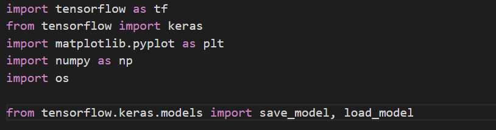

I also installed pyyaml h5py to save/load model.

I saved my model in HDF5 standard:

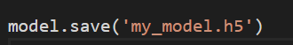

You can reload saved model:

**new\_model = tf.keras.models.load\_model(&#39;my\_model.5&#39;)**

Or just run the program. Each method is in a separate, single file.

I tested both programs directly in Google colab (TensorFlow with GPU). Thanks to high performance of machine computing the model it didn&#39;t take very long. I can highly recommend it.
